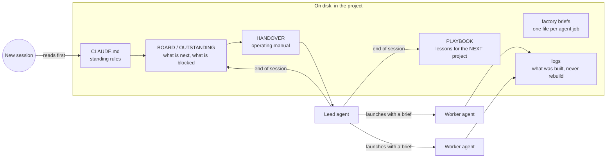

# The model is stateless. Your project isn't.

**How I run multi-week software and content projects with AI coding agents without losing the plot
between sessions.**

I build almost everything with Claude Code in PowerShell on Windows: a live SaaS, a data pipeline,
video pipelines and research tools. The hard part isn't getting the model to write code. It's that
every session starts with an empty head, while the project carries weeks of decisions, dead ends
and rules the owner has already settled.

So I don't keep context in my head or in chat history. I keep it in **files the agent reads first**.

---

## The system

| File | Answers | Changes |
|---|---|---|
| `CLAUDE.md` | *How do we work here?* Rules, boundaries, the owner's standards. | Rarely, and only when a rule is settled |
| `BOARD` / `OUTSTANDING.md` | *What's next, what's blocked, and what does the owner still owe?* | Every session |
| `HANDOVER.md` | *How do I run this if I'm a different model tomorrow?* | When the process changes |
| Factory briefs | *Exactly what a worker agent does, what it writes, and when it stops.* | When a job is redesigned |
| Build logs | *What exists already?* | Every worker, on finish |
| Playbook | *What should the next project do differently?* | End of every session |

## Rules that came from real failures

Each of these was written after something went wrong. Writing the failure down is what stops it
happening twice.

**1. Record the rejected alternatives, not just the decision.**
A ledger that only holds the new decision can't stop a regression. The old idea is still sitting in
older files, and a fresh session finds it and rebuilds it. Superseded decisions now get marked
**RETIRED**, with the reason, and a small audit script flags stale files that still use them.

**2. Two heavy agents at once, maximum.**
I once ran five builder agents in parallel. All five hit the account's session limit at the same
moment and died mid-task. Now there are two lanes, chained: when one finishes, the next starts.
Slower on paper, faster in practice.

**3. The one-way rule.**
The agent may *read* the old research archive but may only *write* inside the current repo.
Nothing downstream can corrupt the source material.

**4. Nothing is deleted without a yes.**
Rejects go to a `99_REJECTS/` folder with the reason in the filename. Old versions get a `_v1`
suffix. It's cheap insurance, and the rejects folder doubles as a record of what didn't work.

**5. Measure, and check what the measurement measured.**
"An audio track is present" was true of a file whose track held digital silence. The claim stood for
three days. Checks now measure the actual thing (loudness, duration against the expected length)
against a control, not just whether a field exists.

**6. Check the live thing before claiming it's done.**
"Uploaded" means I opened the page and saw it. Scheduled jobs only run while a session is awake, so a
reply that was "scheduled" once never got posted. Now the agent verifies on the live site.

**7. Handover that doesn't depend on the model.**
The handover file was written so that when one model's quota ran out, another could pick up the same
day at the same standard, with no re-explaining. The file is the continuity.

## Delegation: briefs, not prompts

Repeated jobs (building a lesson video, cutting short clips, uploading, writing a script) each have a
**brief file**. The lead agent launches a worker whose prompt *is* the brief with the blanks filled.
Each worker:

- reads the build log first, so it never rebuilds finished work
- commits only its own files, and retries if git's index is locked by the other lane
- writes one line to the log when it finishes
- stops at a defined gate (for example "owner watches before it goes public")

With this setup the 31 lesson videos for Trading Reps were built as a queue I checked on, not
something I hand-held one video at a time. All 31 were finished and quality-gated between
13 and 15 Sept 2026.

## What this gets me

- **A new session is productive in minutes**, because the first three files it reads tell it where
  things stand.
- **Decisions stick.** Rejected ideas stay rejected because the rejection is written down with its
  reason.
- **I can switch models** without losing standards.
- **The owner (me) stays the decision-maker.** The agent keeps the files and proposes. Deploys,
  sign-ins, payments and anything public stay with a human.

## What I would tell another builder

Start with three files: `CLAUDE.md` for rules, `OUTSTANDING.md` for next actions, and a log of what
is finished. Update the second and third at the end of every session. Add the rest only when a real
failure tells you to.
