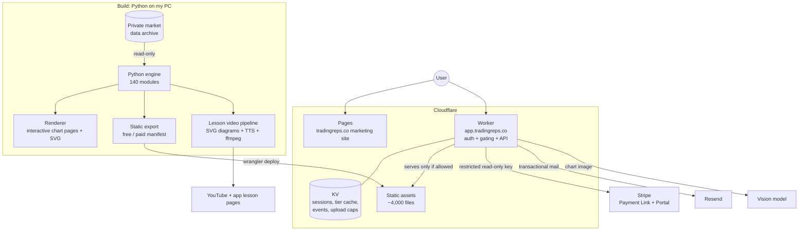

# Trading Reps: a live SaaS built solo with AI coding agents

**[tradingreps.co](https://tradingreps.co)**: a practice gym for beginner traders. Launched 13 Sept 2026.
*The code is private. This write-up covers how the product is built, not how it trades.*

| | |
|---|---|
| **Role** | Founder and sole builder: product, engineering, content, marketing |
| **Built** | First commit 30 Aug 2026 · live 10 Sept · launched 13 Sept · 1,000 commits by 30 Sept |
| **Stack** | Python · Cloudflare Workers + Pages + KV · Stripe · Resend · Lightweight Charts · Gemini (vision + TTS) · ffmpeg · Claude Code |
| **Scale** | 3,100+ real historical chart examples · ~4,000 static files (1,684 pages, 2,243 SVGs) · 31-lesson video course |

---

## The problem

New traders learn from highlight reels: charts picked *after* they worked. So they never see the
setups that looked identical and then failed, and they find out with real money.

Trading Reps gives them **reps on real history with the ending hidden**. You look at a real day's
chart, mark where you'd enter and where your stop goes, and only then is the rest of the day revealed.
Thousands of real examples, including the ones that failed.

## Architecture

**Main design choice: static content behind a smart gate.** The product is about 1 GB of
pre-rendered chart pages. Instead of a database-backed app server, the Python engine renders
everything ahead of time and one Cloudflare Worker sits in front of it with
`run_worker_first = true`. Every request is checked (signed in? free path or paid tier?) before
a file is served. There are no servers to run, and pages are served from Cloudflare's edge.

## Engineering highlights

**Authentication built from primitives.**
The Worker handles email-and-password sign-up with an activation link, and a password-reset flow.
Passwords are hashed with PBKDF2-SHA256 through Web Crypto, using a per-user salt and a secret
pepper, and compared in constant time. After 8 failed logins in 15 minutes the address is locked.
Sessions last 180 days. It launched with magic-link-only sign-in. That was clumsy for users, so I switched to passwords
before the public launch (10 Sept).

**Billing without a webhook or a database.**
Checkout uses a Stripe Payment Link, and billing management uses Stripe's hosted Customer Portal.
The Worker looks up the subscriber's tier with a *restricted, read-only* Stripe key and caches it in
KV for 10 minutes. That leaves fewer moving parts and no webhook endpoint to secure. The trade-off is
that a new subscriber waits up to 10 minutes, which I accepted and documented. A config switch turns
paid mode on or off.

**AI feature: "find days like my chart".**
A user uploads a screenshot of any chart. A vision model reads it as a price path, and the Worker
compares that path against a pre-built index of about 2,000 past days to return the closest
lookalikes. There are daily upload caps per tier, kept in KV, to control model cost.

**Changing ~1,700 rendered pages safely: migrations, not re-renders.**
After launch I found a feature on the practice pages that computed its result from the wrong point in
time. Re-rendering the whole deck would have been slow and risky. Instead I wrote a dated, idempotent
migration script that patched **1,663 of 1,663** pages in place, hiding the feature behind a flag
while keeping the underlying maths. Over the next week there were 14 such migrations, each one safe
to re-run.

**Guard rails enforced in code, not just in the rules file.**
The engine reads from a private archive that a separate live system depends on. A single `guard()`
function blocks any write outside the repo, and a test scans the codebase for writes that skip it.
Secrets never enter git. `.env.example` was committed on day one, real keys live in an ignored folder,
and the Worker's keys are set only through `wrangler secret put`.

**Data refresh without churn.**
The weekly refresh added 38 new examples (3,143 → 3,181) with 0 removed and 0 relabelled, and a
check confirmed that every free and reviewed card was unchanged. Users never lose work they've done.

## The content pipeline: 31 lesson videos, built by agents

The course is generated, not filmed. Each lesson is a script file. The pipeline renders
self-drawing SVG diagrams timed to each voice beat, generates narration with a TTS model, and
encodes with ffmpeg.

Builder agents do the building, working from a written brief:

- at most **two builder agents at once**, three lessons each. Five in parallel once hit the account's
  session limit and all five died.
- each lesson must pass **automated quality gates** before it counts as done:
  - a scan for truncated voice takes (under 60% of expected length is flagged)
  - loudness between −14.5 and −14.0 LUFS
  - a cap on how long the picture can sit still
  - a contact-sheet review
- agents log what they built and commit only their own files, so nothing gets rebuilt or overwritten
- an upload agent drives YouTube Studio in the browser and writes the video IDs back into the app's
  lesson list

All 31 lessons were built and gated between 13 and 15 Sept 2026. How I keep agents like these on
track is in [ai-development-workflow.md](ai-development-workflow.md).

## Product decisions made from evidence

**The practice quiz format.** My first Reddit quiz asked readers to predict what the chart did next.
It got 8.2K views and **net zero upvotes**. The comments rejected the frame, not the chart:
experienced traders read "guess what happens" as gambling. I rebuilt it so readers walk the day
forward and decide at each step, with the answer inside the same post. The next quiz was the
**#1 post of the day on r/Daytrading: 72K views, 122 upvotes, 90.7% upvoted, 232 shares.**

**Killing a format fast.** A post illustrated with AI-generated pictures was called "AI slop" within
10 minutes (25% upvoted). I deleted it at 22 minutes. The rule since then: real charts from the
product only.

**Trust over features.** A trade verdict on the practice screen was confidently wrong on some replays.
It came off the screen the same day (the 1,663-page migration above), and the maths was kept for when
the fix lands. I also rewrote a tooltip that beginners were reading as a pass mark.

**A controlled test on the course.** YouTube data showed viewers leaving during the ~20-second title
openings. I trimmed lessons 1–7 and left 8–31 as the control, with a two-week read of watch-time
against impressions.

## Problems I hit, and what I changed

| Problem | Fix |
|---|---|
| A public YouTube playlist exposed videos meant to be unlisted early access | Unlisted uploads now go only to a private playlist |
| Magic-link-only sign-in was clumsy for users | Password + activation link |
| Parallel agents collided on git and hit session limits | Two lanes, own-files-only commits, retry on `index.lock` |
| TTS occasionally returned a cut-off take | Length scan before any video is packed |
| A backup audit found feature files that were never committed | Push to a private GitHub remote every session; code only, never media |

## Results

- A paid SaaS, live and taking sign-ups: free tier, $29/month plan, Stripe billing
- Live **11 days** after the first commit, publicly launched on day 14
- A 31-lesson course plus marketing across YouTube, Reddit and X
- No servers to run: a static deck behind an edge worker
